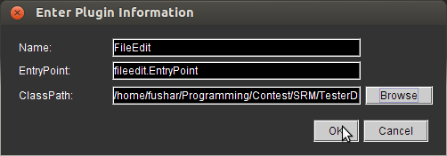
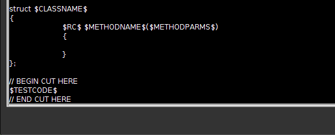
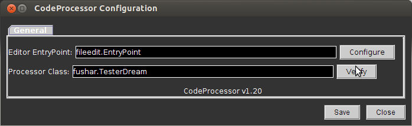
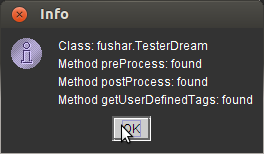

# TesterDream

TesterDream is a TopCoder Arena plugin for testing your solution against example cases in external editor. It works in combination with FileEdit and CodeProcessor plugins.

It will extract the example cases and insert them in your source code. When you run your program, your solution will be automatically tested against them. When you submit your source code, the example cases will be automatically deleted. Your TopCoder SRM experience will become more convenient using this plugin.

This plugin currently only supports C++ language.

## Features

- Testcases are executed on different processes, so you don’t need to clear global variables between testcase runs.
doubles and vector<double>s in return values are compared according to TopCoder’s rule.
- The result of each testcase can be one of the following:
  - Passed
  - Failed
  - Runtime Error
- All testcases are guaranteed to be performed, even when your program crashes in some testcases (unless you kill the program).
- You can add as many custom testcases as you like easily.
- You can view the runtime of your solution for each testcase.
- You can view the current score of your solution, i.e., the points you will receive if you immediately submit your solution.

Here is a sample screenshot of a running program.

```
Testing SomeProblem (250.0 points)
 
#0: Passed (0.00 secs)
#1: Failed (0.36 secs)
           Expected: { "foo", "bar" }
           Received: { "bar", "foo" }
#2: Runtime Error
 
Time  : 9 minutes 3 secs
Score : 227.76 points
```

## Installation

1. Download the latest version [here](https://github.com/fushar/testerdream/releases/download/v1.3.1/TesterDream-v1.3.1.zip).
1. Launch TopCoder Arena and login.
1. Click **Options** -> **Editor**.
1. Click **Add**.
1. Type `FileEdit` in the Name box and `fileedit.EntryPoint` in the EntryPoint box.
1. In the **ClassPath** box, browse the **FileEdit.jar** file in the directory you extracted the plugin.
1. Click **OK**.

   

1. Highlight **FileEdit** and then click **Configure**.
1. Enter your directory to save the problem solutions (the .cpp files).
1. Uncheck **Backup existing file then overwrite**.
1. Click **Code Template** tab.
1. Edit you C++ code template to match your needs. Insert this code at the bottom template. IMPORTANT: If you have another `BEGIN CUT HERE` at the top of your template, please delete it.

        // BEGIN CUT HERE
        $TESTCODE$
        // END CUT HERE

   

1. Click **Save** and then **Close**.
1. Click **Add** again.
1. Type `CodeProcessor` in the **Name** box and `codeprocessor.EntryPoint` in the **EntryPoint** box.
1. In the ClassPath box, browse **FileEdit.jar**, and then **CodeProcessor.jar**, and then **TesterDream.jar**.
1. Click **OK**.
1. Highlight **CodeProcessor** and click **Configure**.
1. Type `fileedit.EntryPoint` in the **Editor EntryPoint** box, and `fushar.TesterDream` in the **Processor Class** box.

   

1. Click **Verify** and make sure you don't get any error messages. Then click **OK**.

   

1. Select **CodeProcessor** as the default editor.
1. Click **Save** and then **Close**.
1. Make sure your default programming language is C++, if not, click **Options** -> **Setup User Preferences**, click **Editors** tab and select C++ in **Default Language**.
1. Enjoy! Now, if you open a problem in SRM, a file with the same name as the problem name will be automatically created in your chosen directory. Write your solution in this file. To check against example cases, run the file. To submit, press **Compile** and then **Submit** in the Arena – no need to delete anything in your code.

## License

TesterDream is licensed under MIT License.
